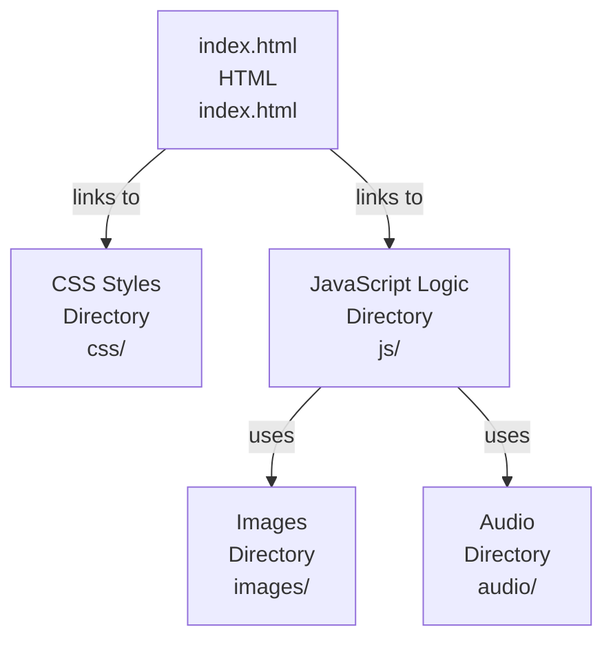

# Codebase Research Report

## Query
Scanne notre projte en tier et fais en larchitetur pour creer le readme 

## Answer
# Architecture du Projet : Jeu de Cartes UNO en JavaScript

Ce document décrit l'architecture du projet "UNO Card Game in JavaScript", un jeu de cartes UNO jouable dans un navigateur web. Le projet est structuré de manière classique pour une application web front-end, séparant la structure HTML, le style CSS et la logique JavaScript.

## Architecture de Haut Niveau

Le projet est composé de plusieurs répertoires principaux et de fichiers racines qui collaborent pour offrir l'expérience de jeu.

*   **[index.html](d:/DocTemplate/Des projets/Jeux/uno-card-game-in-javascript/UNO Card Game in JavaScript/index.html)**: Le point d'entrée de l'application, définissant la structure de la page web.
*   **[css/](d:/DocTemplate/Des projets/Jeux/uno-card-game-in-javascript/UNO Card Game in JavaScript/css/)**: Contient les feuilles de style pour la présentation visuelle du jeu.
*   **[js/](d:/DocTemplate/Des projets/Jeux/uno-card-game-in-javascript/UNO Card Game in JavaScript/js/)**: Contient le fichier JavaScript principal qui gère toute la logique du jeu.
*   **[images/](d:/DocTemplate/Des projets/Jeux/uno-card-game-in-javascript/UNO Card Game in JavaScript/images/)**: Stocke toutes les images des cartes UNO et autres éléments graphiques.
*   **[audio/](d:/DocTemplate/Des projets/Jeux/uno-card-game-in-javascript/UNO Card Game in JavaScript/audio/)**: Contient les fichiers audio utilisés pour les effets sonores du jeu.

### Structure HTML ([index.html](d:/DocTemplate/Des projets/Jeux/uno-card-game-in-javascript/UNO Card Game in JavaScript/index.html))

Le fichier [index.html](d:/DocTemplate/Des projets/Jeux/uno-card-game-in-javascript/UNO Card Game in JavaScript/index.html) est le squelette de l'application. Il définit les zones principales du jeu :

*   **Zone CPU ([.cpu-box](d:/DocTemplate/Des projets/Jeux/uno-card-game-in-javascript/UNO Card Game in JavaScript/index.html:10))**: Affiche la main du CPU et les animations "UNO!".
*   **Zone de Jeu ([.play-area](d:/DocTemplate/Des projets/Jeux/uno-card-game-in-javascript/UNO Card Game in JavaScript/index.html:24))**: Contient le score, la pile de jeu (carte actuellement jouée) et la pile de pioche.
*   **Zone Joueur ([.player-box](d:/DocTemplate/Des projets/Jeux/uno-card-game-in-javascript/UNO Card Game in JavaScript/index.html:50))**: Affiche la main du joueur et les animations "UNO!".
*   **Écrans de Fin de Manche/Partie ([.end-of-round](d:/DocTemplate/Des projets/Jeux/uno-card-game-in-javascript/UNO Card Game in JavaScript/index.html:40), [.end-of-game](d:/DocTemplate/Des projets/Jeux/uno-card-game-in-javascript/UNO Card Game in JavaScript/index.html:43))**: Des éléments cachés qui s'affichent à la fin d'une manche ou de la partie.
*   **Sélecteur de Couleur ([.color-picker](d:/DocTemplate/Des projets/Jeux/uno-card-game-in-javascript/UNO Card Game in JavaScript/index.html:60))**: Un élément caché qui apparaît lorsque le joueur joue une carte "Wild" pour choisir une nouvelle couleur.

Le fichier [index.html](d:/DocTemplate/Des projets/Jeux/uno-card-game-in-javascript/UNO Card Game in JavaScript/index.html) lie également la feuille de style [css/style.css](d:/DocTemplate/Des projets/Jeux/uno-card-game-in-javascript/UNO Card Game in JavaScript/css/style.css:4) et le script JavaScript [js/app.js](d:/DocTemplate/Des projets/Jeux/uno-card-game-in-javascript/UNO Card Game in JavaScript/js/app.js:70).

### Style CSS ([css/style.css](d:/DocTemplate/Des projets/Jeux/uno-card-game-in-javascript/UNO Card Game in JavaScript/css/style.css))

Le fichier [css/style.css](d:/DocTemplate/Des projets/Jeux/uno-card-game-in-javascript/UNO Card Game in JavaScript/css/style.css) est responsable de l'apparence visuelle du jeu. Il définit :

*   Les styles généraux du corps de la page ([body](d:/DocTemplate/Des projets/Jeux/uno-card-game-in-javascript/UNO Card Game in JavaScript/css/style.css:12)).
*   La mise en page des mains du CPU et du joueur ([.cpu-box](d:/DocTemplate/Des projets/Jeux/uno-card-game-in-javascript/UNO Card Game in JavaScript/css/style.css:24), [.player-box](d:/DocTemplate/Des projets/Jeux/uno-card-game-in-javascript/UNO Card Game in JavaScript/css/style.css:42)).
*   Les styles des cartes ([img](d:/DocTemplate/Des projets/Jeux/uno-card-game-in-javascript/UNO Card Game in JavaScript/css/style.css:52)) et leurs interactions au survol ([.player-hand img:hover](d:/DocTemplate/Des projets/Jeux/uno-card-game-in-javascript/UNO Card Game in JavaScript/css/style.css:60)).
*   Les animations pour le tirage et le jeu des cartes ([.player-draw](d:/DocTemplate/Des projets/Jeux/uno-card-game-in-javascript/UNO Card Game in JavaScript/css/style.css:78), [.cpu-draw](d:/DocTemplate/Des projets/Jeux/uno-card-game-in-javascript/UNO Card Game in JavaScript/css/style.css:83), [.play-card](d:/DocTemplate/Des projets/Jeux/uno-card-game-in-javascript/UNO Card Game in JavaScript/css/style.css:98)).
*   Les styles des écrans de fin de manche/partie ([.end-of-round](d:/DocTemplate/Des projets/Jeux/uno-card-game-in-javascript/UNO Card Game in JavaScript/css/style.css:127), [.end-of-game](d:/DocTemplate/Des projets/Jeux/uno-card-game-in-javascript/UNO Card Game in JavaScript/css/style.css:143)).
*   Les styles du sélecteur de couleur ([.color-picker](d:/DocTemplate/Des projets/Jeux/uno-card-game-in-javascript/UNO Card Game in JavaScript/css/style.css:170)) et des boutons de couleur.
*   Des requêtes média pour la réactivité sur différentes tailles d'écran ([@media (max-width: 812px)](d:/DocTemplate/Des projets/Jeux/uno-card-game-in-javascript/UNO Card Game in JavaScript/css/style.css:220)).

### Logique de Jeu JavaScript ([js/app.js](d:/DocTemplate/Des projets/Jeux/uno-card-game-in-javascript/UNO Card Game in JavaScript/js/app.js))

Le fichier [js/app.js](d:/DocTemplate/Des projets/Jeux/uno-card-game-in-javascript/UNO Card Game in JavaScript/js/app.js) est le cœur de l'application, gérant toute la logique du jeu UNO.

#### Variables Globales et Éléments DOM

Le script commence par sélectionner les éléments DOM nécessaires et définir des variables globales pour l'état du jeu, les mains des joueurs et le paquet de cartes ([js/app.js](d:/DocTemplate/Des projets/Jeux/uno-card-game-in-javascript/UNO Card Game in JavaScript/js/app.js:4-20)).

#### Préchargement des Images ([preLoadImgs](d:/DocTemplate/Des projets/Jeux/uno-card-game-in-javascript/UNO Card Game in JavaScript/js/app.js:26))

La fonction `preLoadImgs` précharge toutes les images des cartes pour une meilleure performance visuelle, évitant les retards de chargement pendant le jeu.

#### Gestion Audio ([#region AUDIO](d:/DocTemplate/Des projets/Jeux/uno-card-game-in-javascript/UNO Card Game in JavaScript/js/app.js:42))

Le jeu intègre divers effets sonores pour améliorer l'expérience utilisateur. Chaque son est instancié comme un objet `Audio` ([shuffleFX](d:/DocTemplate/Des projets/Jeux/uno-card-game-in-javascript/UNO Card Game in JavaScript/js/app.js:43), [playCardFX](d:/DocTemplate/Des projets/Jeux/uno-card-game-in-javascript/UNO Card Game in JavaScript/js/app.js:44), etc.) et joué à des moments clés du jeu.

#### Gestion des Cartes et du Paquet ([#region CARD AND DECK MANAGEMENT](d:/DocTemplate/Des projets/Jeux/uno-card-game-in-javascript/UNO Card Game in JavaScript/js/app.js:59))

*   **Classe `Card` ([Card](d:/DocTemplate/Des projets/Jeux/uno-card-game-in-javascript/UNO Card Game in JavaScript/js/app.js:60))**: Définit la structure d'une carte UNO avec des propriétés comme la couleur, la valeur, les points, l'effet de changement de tour, la valeur de pioche et l'image source.
*   **`createCard` ([createCard](d:/DocTemplate/Des projets/Jeux/uno-card-game-in-javascript/UNO Card Game in JavaScript/js/app.js:71))**: Crée des instances de cartes et les ajoute au paquet global (`deck`).
*   **`createDeck` ([createDeck](d:/DocTemplate/Des projets/Jeux/uno-card-game-in-javascript/UNO Card Game in JavaScript/js/app.js:107))**: Initialise un nouveau paquet de cartes complet.
*   **`shuffleDeck` ([shuffleDeck](d:/DocTemplate/Des projets/Jeux/uno-card-game-in-javascript/UNO Card Game in JavaScript/js/app.js:127))**: Mélange le paquet de cartes.

#### Comportements du Jeu ([#region GAME BEHAVIOURS](d:/DocTemplate/Des projets/Jeux/uno-card-game-in-javascript/UNO Card Game in JavaScript/js/app.js:138))

Cette section contient les fonctions fondamentales pour le déroulement du jeu :

*   **`dealCards` ([dealCards](d:/DocTemplate/Des projets/Jeux/uno-card-game-in-javascript/UNO Card Game in JavaScript/js/app.js:139))**: Distribue les cartes initiales au CPU et au joueur.
*   **`startPlayPile` ([startPlayPile](d:/DocTemplate/Des projets/Jeux/uno-card-game-in-javascript/UNO Card Game in JavaScript/js/app.js:160))**: Place la première carte sur la pile de jeu.
*   **`newHand` ([newHand](d:/DocTemplate/Des projets/Jeux/uno-card-game-in-javascript/UNO Card Game in JavaScript/js/app.js:177))**: Réinitialise le jeu pour une nouvelle manche.
*   **`updatePlayPileDom` ([updatePlayPileDom](d:/DocTemplate/Des projets/Jeux/uno-card-game-in-javascript/UNO Card Game in JavaScript/js/app.js:196))**: Met à jour l'affichage de la carte sur la pile de jeu.
*   **`updateHand` ([updateHand](d:/DocTemplate/Des projets/Jeux/uno-card-game-in-javascript/UNO Card Game in JavaScript/js/app.js:207))**: Met à jour l'affichage des mains du joueur et du CPU.
*   **`drawCard` ([drawCard](d:/DocTemplate/Des projets/Jeux/uno-card-game-in-javascript/UNO Card Game in JavaScript/js/app.js:242))**: Gère la pioche d'une carte par un joueur.
*   **`animateDrawCard` ([animateDrawCard](d:/DocTemplate/Des projets/Jeux/uno-card-game-in-javascript/UNO Card Game in JavaScript/js/app.js:275))**: Anime le processus de pioche d'une carte.
*   **`showUno` ([showUno](d:/DocTemplate/Des projets/Jeux/uno-card-game-in-javascript/UNO Card Game in JavaScript/js/app.js:294))**: Affiche l'animation "UNO!" pour le joueur ou le CPU.
*   **`showColorPicker` ([showColorPicker](d:/DocTemplate/Des projets/Jeux/uno-card-game-in-javascript/UNO Card Game in JavaScript/js/app.js:315))**: Affiche le sélecteur de couleur pour les cartes "Wild".
*   **`chooseColor` ([chooseColor](d:/DocTemplate/Des projets/Jeux/uno-card-game-in-javascript/UNO Card Game in JavaScript/js/app.js:344))**: Applique la couleur choisie à la carte "Wild".
*   **`hideColorPicker` ([hideColorPicker](d:/DocTemplate/Des projets/Jeux/uno-card-game-in-javascript/UNO Card Game in JavaScript/js/app.js:353))**: Cache le sélecteur de couleur.
*   **`skipOrEndTurn` ([skipOrEndTurn](d:/DocTemplate/Des projets/Jeux/uno-card-game-in-javascript/UNO Card Game in JavaScript/js/app.js:358))**: Gère le changement de tour ou le saut de tour.
*   **`showTurnOnDom` ([showTurnOnDom](d:/DocTemplate/Des projets/Jeux/uno-card-game-in-javascript/UNO Card Game in JavaScript/js/app.js:370))**: Met en évidence le joueur dont c'est le tour.

#### Fonctions de Fin de Manche/Partie ([#region END OF ROUND/GAME FUNCTIONS](d:/DocTemplate/Des projets/Jeux/uno-card-game-in-javascript/UNO Card Game in JavaScript/js/app.js:382))

*   **`tallyPoints` ([tallyPoints](d:/DocTemplate/Des projets/Jeux/uno-card-game-in-javascript/UNO Card Game in JavaScript/js/app.js:383))**: Calcule les points du perdant de la manche.
*   **`updateScores` ([updateScores](d:/DocTemplate/Des projets/Jeux/uno-card-game-in-javascript/UNO Card Game in JavaScript/js/app.js:395))**: Met à jour l'affichage des scores.
*   **`checkForWinner` ([checkForWinner](d:/DocTemplate/Des projets/Jeux/uno-card-game-in-javascript/UNO Card Game in JavaScript/js/app.js:408))**: Vérifie si un joueur a gagné la manche ou la partie.
*   **`showCpuCards` ([showCpuCards](d:/DocTemplate/Des projets/Jeux/uno-card-game-in-javascript/UNO Card Game in JavaScript/js/app.js:429)) / `hideCpuCards` ([hideCpuCards](d:/DocTemplate/Des projets/Jeux/uno-card-game-in-javascript/UNO Card Game in JavaScript/js/app.js:445))**: Affiche ou cache les cartes du CPU.
*   **`endRound` ([endRound](d:/DocTemplate/Des projets/Jeux/uno-card-game-in-javascript/UNO Card Game in JavaScript/js/app.js:461))**: Gère la fin d'une manche.
*   **`endGame` ([endGame](d:/DocTemplate/Des projets/Jeux/uno-card-game-in-javascript/UNO Card Game in JavaScript/js/app.js:486))**: Gère la fin de la partie et l'option de rejouer.

#### Logique du CPU ([#region ////////CPU LOGIC////////](d:/DocTemplate/Des projets/Jeux/uno-card-game-in-javascript/UNO Card Game in JavaScript/js/app.js:523))

Cette section est dédiée à l'intelligence artificielle du CPU :

*   **`letCpuDrawCards` ([letCpuDrawCards](d:/DocTemplate/Des projets/Jeux/uno-card-game-in-javascript/UNO Card Game in JavaScript/js/app.js:524))**: Fait piocher des cartes au CPU si une carte `+2` ou `+4` a été jouée.
*   **`playCPU` ([playCPU](d:/DocTemplate/Des projets/Jeux/uno-card-game-in-javascript/UNO Card Game in JavaScript/js/app.js:534))**: La fonction principale qui orchestre le tour du CPU, incluant la détermination des cartes jouables et la stratégie.
*   **`determinePlayableCards` ([determinePlayableCards](d:/DocTemplate/Des projets/Jeux/uno-card-game-in-javascript/UNO Card Game in JavaScript/js/app.js:567))**: Identifie les cartes que le CPU peut jouer.
*   **`runStrategist` ([runStrategist](d:/DocTemplate/Des projets/Jeux/uno-card-game-in-javascript/UNO Card Game in JavaScript/js/app.js:590))**: Implémente la logique de décision du CPU pour choisir quelle carte jouer.
*   **`playCPUCard` ([playCPUCard](d:/DocTemplate/Des projets/Jeux/uno-card-game-in-javascript/UNO Card Game in JavaScript/js/app.js:634))**: Exécute l'action de jouer une carte par le CPU.
*   **`chooseColorAfterWild` ([chooseColorAfterWild](d:/DocTemplate/Des projets/Jeux/uno-card-game-in-javascript/UNO Card Game in JavaScript/js/app.js:709))**: Le CPU choisit une nouvelle couleur après avoir joué une carte "Wild".
*   **`hitWithDrawCard` ([hitWithDrawCard](d:/DocTemplate/Des projets/Jeux/uno-card-game-in-javascript/UNO Card Game in JavaScript/js/app.js:734))**: Anime l'effet de pioche forcée.

#### Interaction du Joueur ([playPlayerCard](d:/DocTemplate/Des projets/Jeux/uno-card-game-in-javascript/UNO Card Game in JavaScript/js/app.js:742))

*   **`playPlayerCard` ([playPlayerCard](d:/DocTemplate/Des projets/Jeux/uno-card-game-in-javascript/UNO Card Game in JavaScript/js/app.js:742))**: Gère l'action du joueur de jouer une carte.
*   Des écouteurs d'événements sont attachés à la main du joueur ([playerHandDom.addEventListener](d:/DocTemplate/Des projets/Jeux/uno-card-game-in-javascript/UNO Card Game in JavaScript/js/app.js:766)) et à la pile de pioche ([drawPileDom.addEventListener](d:/DocTemplate/Des projets/Jeux/uno-card-game-in-javascript/UNO Card Game in JavaScript/js/app.js:824)) pour gérer les clics du joueur.

#### Fonction Principale du Jeu ([startGame](d:/DocTemplate/Des projets/Jeux/uno-card-game-in-javascript/UNO Card Game in JavaScript/js/app.js:750))

La fonction `startGame` initialise le jeu, met en place les écouteurs d'événements et lance la première manche.

#### Mode Développeur ([listenForDevMode](d:/DocTemplate/Des projets/Jeux/uno-card-game-in-javascript/UNO Card Game in JavaScript/js/app.js:840))

Une fonction `listenForDevMode` permet d'activer des fonctionnalités de débogage via des raccourcis clavier, comme forcer le tour du joueur, piocher des cartes, ou modifier les scores.

### Actifs

*   **[images/](d:/DocTemplate/Des projets/Jeux/uno-card-game-in-javascript/UNO Card Game in JavaScript/images/)**: Ce répertoire contient toutes les images des cartes UNO (numérotées, spéciales, wild) ainsi que l'image de dos de carte et le logo "UNO!".
*   **[audio/](d:/DocTemplate/Des projets/Jeux/uno-card-game-in-javascript/UNO Card Game in JavaScript/audio/)**: Ce répertoire contient divers fichiers audio au format `.wav` et `.mp3` pour les effets sonores du jeu, tels que le mélange des cartes, la pioche, le jeu de cartes, les sons de victoire/défaite, et les sons "UNO!".

---
*Generated by [CodeViz.ai](https://codeviz.ai) on 27/08/2025 01:44:26*
